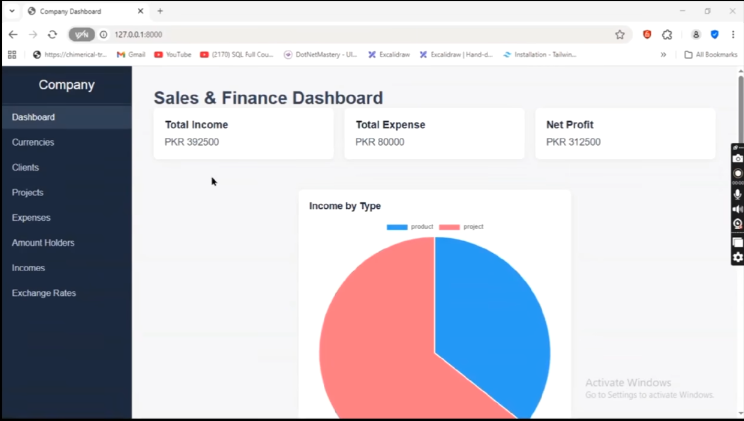
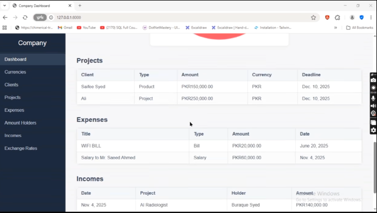
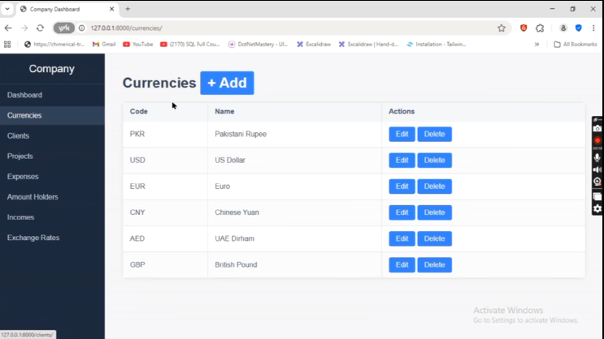
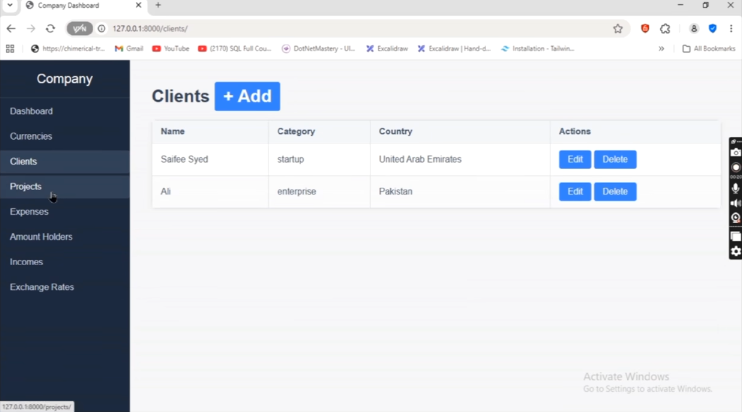
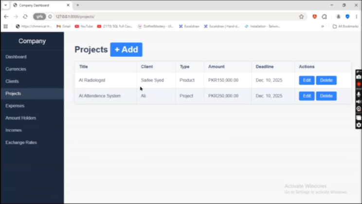
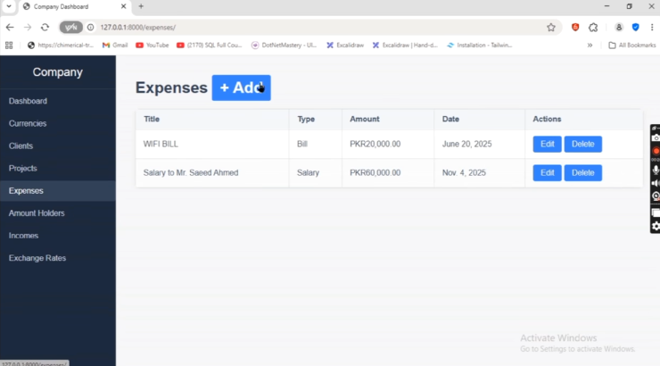
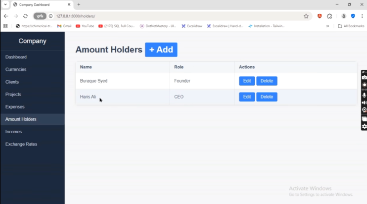

# Company Management System 🏢

A Django-based internal management system for tracking company finances, projects, clients, and multi-currency transactions — built with real-time currency conversion for businesses operating across multiple currencies.

> This is a **showcase repository** presenting screenshots and a project overview. Full source code is kept private.

---

## 📖 About

This system centralizes core company operations into a single dashboard — sales, expenses, project tracking, client management, and multi-currency accounting — designed for small-to-medium businesses that need a lightweight, self-hosted alternative to heavier ERP tools.

---

## ✨ Key Features

- **Sales & Finance Dashboard** — Real-time overview of total income, total expenses, and net profit, visualized with income-by-type breakdown charts
- **Real-Time Currency Conversion** — Multi-currency support with live exchange rate conversion, allowing transactions and reports to be tracked accurately across different currencies
- **Project Management** — Track active projects with assigned currency, deadlines, and status
- **Client Management** — Centralized client directory with contact and account details
- **Expense Tracking** — Log and categorize company expenses by project and date
- **Amount Holders (Accounts)** — Manage multiple financial accounts/holders and track balances across them
- **Add/Edit Workflows** — Quick-add functionality across projects, expenses, currencies, and clients for fast data entry

---

## 🛠️ Tech Stack

- **Backend:** Django
- **Frontend:** Django Templates
- **Currency Data:** Real-time exchange rate API integration
- **Visualization:** Chart-based dashboard (income vs. expense breakdown)
- **Database:** SQL (Django ORM)

---

## 🖥️ Screenshots

  
  
  
  

  
  
  

---

## 👤 Developer

Built by **Buraque** — Founder, CEO @ Youngdev Interns.
Full profile: [github.com/Buraquescode](https://github.com/Buraquescode)
